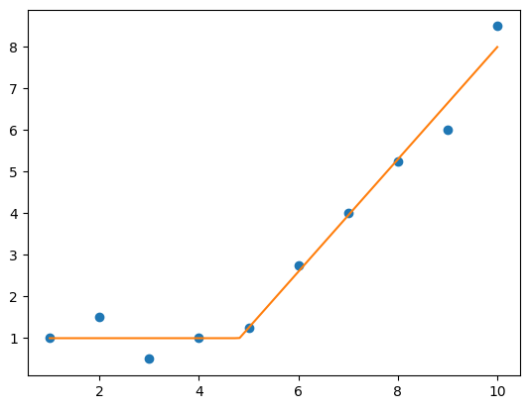

# pwlreg

A scikit-learn-compatible implementation of Piecewise Linear Regression

## Installation

```
pip install git+https://github.com/ensley-nexant/pwlreg.git@main#egg=pwlreg
```

## Usage Guide

[See the how-to guide here](https://github.com/ensley-nexant/pwlreg/blob/main/notebooks/howto.ipynb).


```python
import numpy as np
import matplotlib.pyplot as plt

import pwlreg as pw


x = np.array([1., 2., 3., 4., 5., 6., 7., 8., 9., 10.])
y = np.array([1., 1.5, 0.5, 1., 1.25, 2.75, 4, 5.25, 6., 8.5])

m = pw.AutoPiecewiseRegression(n_segments=2, degree=[0, 1])
m.fit(x, y)

xx = np.linspace(1, 10, 100)
plt.plot(x, y, "o")
plt.plot(xx, m.predict(xx), "-")
plt.show()
```



```python
m.coef_         # [ 1.00  -5.50  1.35 ]
m.breakpoints_  # [ 1.000000  4.814815  10.000000 ]
```

$$
x =
\begin{cases}
1,            & 1 \leq x < 4.815 \\
-5.5 + 1.35x, & 4.815 \leq x < 10
\end{cases}
$$
