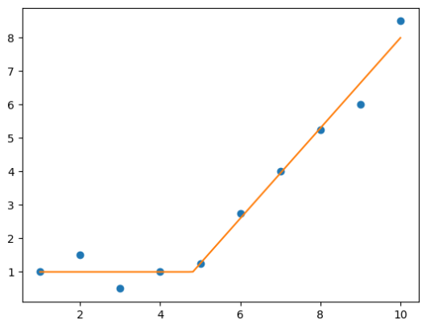

# `pwlreg` - Piecewise Linear Regression

`pwlreg` is a scikit-learn-compatible implementation of Piecewise Linear Regression.

## Installation

### With pip

```shell
pip install pwlreg
```

## Usage

See the [quickstart guide](quickstart.ipynb) to get started with `pwlreg`.

```python
import numpy as np
import matplotlib.pyplot as plt

import pwlreg as pw


x = np.array([1., 2., 3., 4., 5., 6., 7., 8., 9., 10.])
y = np.array([1., 1.5, 0.5, 1., 1.25, 2.75, 4, 5.25, 6., 8.5])

m = pw.AutoPiecewiseRegression(n_segments=2, degree=[0, 1])
m.fit(x, y)

xx = np.linspace(1, 10, 100)
plt.plot(x, y, "o")
plt.plot(xx, m.predict(xx), "-")
plt.show()
```


